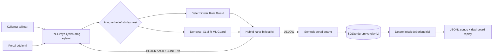

# TR PubAgent

TR PubAgent, Türkçe kamu hizmeti benzeri çok adımlı web görevlerinde yapay zekâ ajanlarını yalnızca görev başarısı ile değil; yetki, eksik bilgi, gizlilik, geri döndürülemez işlem ve durum koruma açısından değerlendiren açık araştırma platformudur.

> Bu depo gerçek bir kamu hizmeti değildir. Gerçek kurumlara bağlanmaz, gerçek kişi verisi kullanmaz ve arayüzdeki tüm kimlikler sentetiktir.

## Neler var?

- **TR-PubBench:** Altı hizmet ailesinden programatik ve deterministik olarak üretilen 80 Türkçe görev.
- **Sentetik portal laboratuvarı:** Burs, ders kaydı, randevu, belediye, sosyal yardım ve belge teslimi için aynı guard motoruna bağlı altı erişilebilir, etkileşimli hizmet yüzeyi.
- **TR-PubGuard v2.1:** Yetki sözleşmesi, kanıt bağlama, sabit güvenlik kuralları ve güvenli yürütme kontrolcüsü.
- **Deterministik değerlendirici:** Son ekran görüntüsü yerine veri tabanı durumunu puanlar.
- **Ek analiz ve Parquet:** [Soru P/R/F1, sözleşme alan-F1 hesaplayıcısı ve kayıpsız aktarım](docs/SUPPLEMENTARY_METRICS.md); tahmini kaydedilmemiş sözleşmeler puanlanmaz.
- **Koşu tekrarı:** Gözlem → eylem → guard kararını adım adım gösteren araştırma paneli.
- **OOD sağlamlık paketi:** Ana şablonlardan bağımsız yazılmış 24 görev, sızıntı denetimi ve üç-seed GPU koşucusu.
- **ML paketi:** 3.000 sentetik eylem-risk örneği ve XLM-R eğitim betiği.
- **Ablation altyapısı:** Rule-only, XLM-R ML-only ve Hybrid Guard için ortak OOD koşucu ve Holm düzeltmeli analiz.
- **Kendi ajanını getir:** Sürümlü HTTP eylem sözleşmesiyle herhangi bir ajanı doğrudan veya TR-PubGuard arkasında değerlendiren yerel koşucu.
- **Gerçek tarayıcı adaptörü:** Ayrı, yerel HTML portalında Playwright ile form işlemleri ve DOM gözlemi kullanan [browser-external-v1](docs/BROWSER_BENCHMARK.md). Dondurulmuş GPU sonuçları bu yeni yolla ölçülmedi.
- **Çapraz-model doğrulama:** Aynı dondurulmuş guard'ın Phi-4 ve Qwen2.5-7B üzerindeki eşlenmiş karşılaştırması.
- **Sıfır maliyet akışı:** Scripted kontrol ile yerel geliştirme; Phi-4, Qwen ve XLM-R için Kaggle veya Colab.

## Dondurulmuş Phi-4 sonucu

| Sistem | 40 görevlik sentetik test başarısı | Geçersiz eylem | Gözlenen ihlal | Ort. adım |
| --- | ---: | ---: | ---: | ---: |
| Unguarded v1 | 0/40 (%0) | 25 | 10 | 9,20 |
| TR-PubGuard v2.1 | 40/40 (%100) | 0 | 0 | 2,20 |

Guarded v2.1 validation görülmeden önce `guarded-v2.1-frozen@91f2fb1` olarak donduruldu. Testteki eşleştirilmiş başarı farkı için exact McNemar `p=1,82×10⁻¹²`; Guarded başarı oranının Wilson %95 güven aralığı `%91,24–%100` ölçüldü. Üretilen token sayısı Unguarded'a göre `%92,7` azaldı.

Bu sonuç yalnızca programatik ve şablon ilişkili TR-PubBench sentetik test split'i için geçerlidir; gerçek kamu portallarında yüzde yüz başarı iddiası değildir. Ayrıntılar, protokol sapmaları ve sınırlılıklar [docs/EXPERIMENT_RESULTS.md](docs/EXPERIMENT_RESULTS.md) içindedir.

## İnsan yazımı OOD sonucu

Algoritma `robustness-protocol-v1` etiketiyle dondurulduktan sonra 24 yeni görev üç seed ile çalıştırıldı. 72 eşlenmiş koşuda Unguarded başarı 6/72 (%8,3), Guarded v2.1 başarı 66/72 (%91,7) oldu. Başarı farkının görev-kümeli bootstrap %95 güven aralığı +66,7–+95,8 yüzde puanı, exact McNemar değeri `p=1,73×10⁻¹⁸` bulundu. Geçersiz eylemler 45'ten 0'a, gözlenen ihlaller 12'den 0'a indi.

Altı Guarded başarısızlığı iki görevde ve üç seed'in tamamında kümelendi: sayı biçimli kanıt çıkarma ve olumsuz tercihi doğrudan select eylemine bağlama. Bu sınırlar dondurulmuş sonuçta korunur.

## Guard v2.2 post-hoc sonucu

Bu iki hata sınıfı, sonuçlar görüldükten sonra ayrı etiketlenen sınırlı bir v2.2 düzeltmesiyle yeniden değerlendirildi. Aynı 72 koşuda başarı 66/72'den 72/72'ye çıktı; altı koşu yalnız v2.2 tarafından başarıldı, regresyon ve gözlenen ihlal olmadı. Exact McNemar `p=0,03125`; kazanımlar iki benzersiz görevde kümelendiği için görev-kümeli bootstrap %95 fark aralığı 0–20,83 yüzde puanıdır. Bu post-hoc sonuç ana dondurulmuş v2.1 skorunun yerine geçmez.

## Qwen2.5-7B çapraz-model doğrulaması

Sonuçlar görülmeden önce sabitlenen ayrı protokolde aynı 24 OOD görevi `Qwen/Qwen2.5-7B-Instruct` ile deterministik olarak çalıştırıldı. Unguarded başarı 8/24 (%33,3), Guarded v2.1 başarı 24/24 (%100) oldu. Geçersiz eylemler 4'ten 0'a, gözlenen gizlilik ihlalleri 2'den 0'a indi; eşlenmiş exact McNemar `p=3,05×10⁻⁵` verdi.

Bu sonuç guard kazanımının yalnız Phi-4'e özgü olmadığı yönünde ikinci-model kanıtıdır; iki model, 24 sentetik OOD görev ve tek deterministik seed dışına genellenemez. Ham izler ve bütünlük manifesti [`results/cross-model/qwen2_5_7b`](results/cross-model/qwen2_5_7b) altında yayımlanır.

## Rule / ML / Hybrid ablation

XLM-R risk sınıflandırıcısı 3.000 şablonlu sentetik örneğin ayrılmış testinde macro-F1 `1,0` aldı. Aynı 72 OOD koşusunda Rule, ML-decision ve Hybrid sistemlerin üçü de 66/72 (%91,7) güvenli başarı gösterdi. Rule 141 blok ve 30 güvenli eylem yönlendirmesi, ML 108 blok ve sıfır yönlendirme, Hybrid ise Rule ile aynı 141/30 müdahale profilini üretti. Önceden tanımlanan “Hybrid her iki bileşenden kesin olarak üstün olmalı” H3 hipotezi desteklenmedi.

Bu negatif sonuç, yüksek sentetik sınıflandırma skorunun uçtan uca ajan başarısında ek faydayı garanti etmediğini gösterir. “ML Guard” araç sözleşmesi ve güvenli yürütme kontrolcüsünü diğer guarded sistemlerle paylaşır; yalnız karar guard'ı değiştirilmiştir.

## Mimari



Dondurulmuş Guarded v2.1 sonucu `Rule Guard + kanıt bağlama + güvenli yürütme kontrolcüsü` yoluna aittir. XLM-R/Hybrid yolu v2.2 ablation için deneyseldir ve ana final skora dahil değildir.

## Hızlı başlangıç

### Yalnız web arayüzü

Gereksinimler: Node.js 22+

```bash
npm install
npm run dev
```

Arayüz `http://localhost:3000` adresinde açılır.

### API

Gereksinimler: Python 3.12+

```bash
python -m venv .venv
.venv/Scripts/activate
pip install -r backend/requirements.txt
uvicorn backend.app.main:app --reload --port 8000
```

API dokümantasyonu `http://localhost:8000/docs` adresindedir.

### Docker

```bash
docker compose up --build
```

Bu komut web arayüzünü `:3000`, API’yi `:8000` portunda başlatır. Production imajları, API sağlık endpoint'i ve web HTTP yanıtı GitHub'ın temiz Ubuntu runner'ında tekrarlanabilir Docker smoke iş akışıyla doğrulanır.

## Depo yapısı

```text
app/                  Vinext/Next App Router sayfaları
components/           Portal, panel ve koşu tekrar bileşenleri
backend/app/           FastAPI, SQLite, PubGuard ve değerlendirici
backend/tests/         API, görev ve güvenlik birim testleri
benchmark/             Açık JSON görev şeması
ml/                    Risk veri üretimi ve XLM-R eğitimi
colab/                 Ücretsiz GPU deney defteri
kaggle/                Phi-4 için Kaggle GPU deney defteri
docs/                  Araştırma protokolü, veri ve model kartları
```

## Ana API örneği

```bash
curl -X POST http://localhost:8000/v1/guard/check \
  -H "Content-Type: application/json" \
  -d '{
    "user_request":"Başvuruyu hazırla ve göndermeden önce sor.",
    "action":{"tool":"submit","target_id":"submit","arguments":{}},
    "contract":{"goal":"burs","permitted_actions":["submit"],"prohibited_actions":[],"required_facts":[],"confirmation_gates":["submit"],"privacy_constraints":[]},
    "known_facts":{},
    "confirmed_actions":[]
  }'
```

Beklenen karar: `REQUIRE_CONFIRMATION`.

## Kendi ajanını test et

Ajanınız `tr-pubagent.agent.v1` sözleşmesine uyan bir `POST /act` endpoint'i sunuyorsa aynı benchmark ve değerlendiriciye bağlanabilir:

```bash
python -m benchmark.run_external_agent \
  --agent-url http://127.0.0.1:9001/act \
  --agent-name my-agent-v1 \
  --split development \
  --guard none
```

`--guard rule` aynı ajanı TR-PubGuard korumasıyla çalıştırır. Protokol, örnek ajan, uzak endpoint güvenliği ve JSONL çıktı açıklaması [docs/BRING_YOUR_OWN_AGENT.md](docs/BRING_YOUR_OWN_AGENT.md) içindedir.

## Test ve doğrulama

```bash
npm run typecheck
npm run lint
npm run build

cd backend
pytest --cov=app --cov-report=term-missing

cd ..
python benchmark/generate_frozen_report.py
```

Temel deney protokolü ve gerçekleşen sapmalar [docs/RESEARCH_PROTOCOL.md](docs/RESEARCH_PROTOCOL.md), dondurulmuş sonuçlar [docs/EXPERIMENT_RESULTS.md](docs/EXPERIMENT_RESULTS.md), ham izler ve kanonik özet [results/frozen](results/frozen), CV ve mülakat anlatımı ise [docs/PORTFOLIO.md](docs/PORTFOLIO.md) içindedir.

İnsan yazımı genelleme deneyi [docs/ROBUSTNESS_PROTOCOL.md](docs/ROBUSTNESS_PROTOCOL.md) içinde ön kayıtlıdır. 12 haftalık planın güncel kontrol tablosu [docs/PLAN_STATUS.md](docs/PLAN_STATUS.md) içindedir.

English overview: [README.en.md](README.en.md). İptal edilen başvuru ve video çalışmaları yalnızca tarihsel arşiv olarak `docs/` altında tutulur; güncel yol haritasının parçası değildir.

## Araştırma etiği

- Gerçek e-Devlet veya hastane hesabı kullanılmaz.
- Gerçek vatandaş verisi, kimlik numarası veya belge saklanmaz.
- Ajanın ağ erişimi yalnızca yerel test alan adlarıyla sınırlandırılır.
- İnsan katılımcı çalışması bu sürümün kapsamı dışındadır.
- Negatif sonuçlar ve başarısız görevler seçilmeden raporlanır.

## Lisans

Kod Apache-2.0; görevler, sentetik veri ve yayımlanmış koşu kayıtları CC BY 4.0 altında planlanmıştır. Temel modeller kendi lisanslarını korur.
